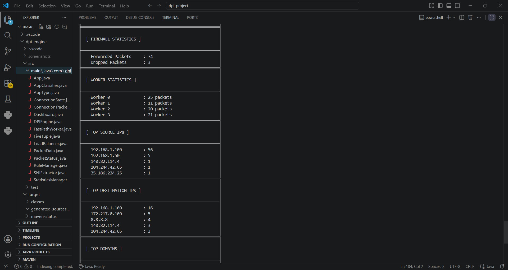
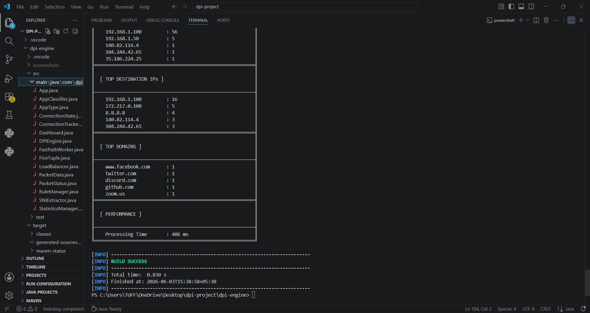

# Deep Packet Inspection (DPI) Engine

> A multi-threaded Java-based Deep Packet Inspection (DPI) Engine for network traffic analysis, packet classification, connection tracking, firewall rule enforcement, and traffic analytics.

---

## Overview
The Deep Packet Inspection (DPI) Engine is a networking and cybersecurity project that analyzes traffic from PCAP files and performs packet-level inspection to identify applications, domains, protocols, and connection behavior.

The system simulates core functionalities used in enterprise network monitoring, traffic management, and security solutions by combining packet parsing, connection tracking, application classification, and rule-based filtering.

---

## Project Status
Completed and actively maintained for learning purposes.

Current capabilities include:
- PCAP traffic processing
- Application classification
- Connection tracking
- Rule-based filtering
- Traffic analytics

---

## Problem Statement
Modern networks generate massive volumes of traffic that must be inspected, classified, and monitored efficiently. Traditional packet filtering based only on IP addresses and ports provides limited visibility.

This project demonstrates how Deep Packet Inspection techniques can be used to analyze network traffic, classify applications, track active connections, extract TLS SNI information, and generate meaningful traffic analytics.

---

## Features
* PCAP File Processing
* TCP/UDP Packet Analysis
* Five Tuple Extraction
* Deep Packet Inspection (DPI)
* TLS SNI Extraction
* Application Classification
* Connection Tracking
* Firewall Rule Engine
* Multi-threaded Packet Processing
* Load Balancing
* Traffic Analytics Dashboard
* Top Source/Destination IP Analysis
* Domain Analysis
* Worker Performance Monitoring
* Protocol Distribution Analysis

---

## Architecture
```text

                     PCAP File
                         │
                         ▼
                 Packet Parser
                         │
                         ▼
               Connection Tracker
                         │
                         ▼
                    DPI Engine
                         │
       ┌─────────────────┼─────────────────┐
       │                 │                 │
       ▼                 ▼                 ▼
 Application      TLS SNI Extraction   Rule Engine
 Classification
                         │
                         ▼
                   Load Balancer
                         │
           ┌─────────────┴─────────────┐
           │                           │
           ▼                           ▼
     Fast Path Worker 1        Fast Path Worker N
           │                           │
           └─────────────┬─────────────┘
                         │
                         ▼
                 Statistics Manager
                         │
                         ▼
                  Dashboard Report
```


## Technologies Used
* Java 17
* Maven
* Pcap4J
* Object-Oriented Programming
* Multithreading
* Concurrent Queues
* Network Programming
* Packet Analysis
* Traffic Classification

---

## Skills Demonstrated
* Java Development
* Software Architecture Design
* Network Traffic Analysis
* Deep Packet Inspection
* Concurrent Programming
* Multithreading
* Connection Tracking
* Firewall Rule Processing
* Packet Parsing
* Traffic Analytics
* Performance Monitoring

---

## Project Structure
```text
src/main/java/com/dpi
│
├── App.java
├── DPIEngine.java
├── FastPathWorker.java
├── LoadBalancer.java
├── ConnectionTracker.java
├── RuleManager.java
├── StatisticsManager.java
├── Dashboard.java
├── PacketData.java
├── PacketStatus.java
├── FiveTuple.java
├── AppClassifier.java
└── SNIExtractor.java
```

---

## Dashboard Screenshots

### Dashboard Overview


### Application Analysis


### Network Analysis



### Performance Analysis



---

## Build and Run

### Clone Repository

```bash
git clone https://github.com/Bhuwangithub/deep-packet-inspection-engine.git
```

### Navigate to Project

```bash
cd deep-packet-inspection-engine
```

### Compile Project

```bash
mvn clean compile
```

### Run Application

```bash
mvn exec:java
```

---

## Project Highlights

* Designed a multi-threaded packet processing architecture using worker threads and load balancing.
* Implemented Five Tuple based connection tracking for network flow identification.
* Built a rule-based firewall engine capable of packet filtering decisions.
* Developed TLS SNI extraction for domain-level traffic visibility.
* Generated detailed traffic analytics including protocol distribution, domain statistics, and worker performance metrics.
* Applied Deep Packet Inspection techniques to classify network traffic and identify applications.

---

## Future Enhancements

* Real-time packet capture support
* HTTP Header Inspection
* Advanced Protocol Detection
* Intrusion Detection Signatures
* Web-Based Monitoring Dashboard
* Distributed Packet Processing
* Machine Learning Based Traffic Classification

---

## Author

**Bhuwan Giripunje**

Engineering Student focused on Java, Networking, Multithreading, and System Design.

---

## License

This project is intended for educational and learning purposes.
